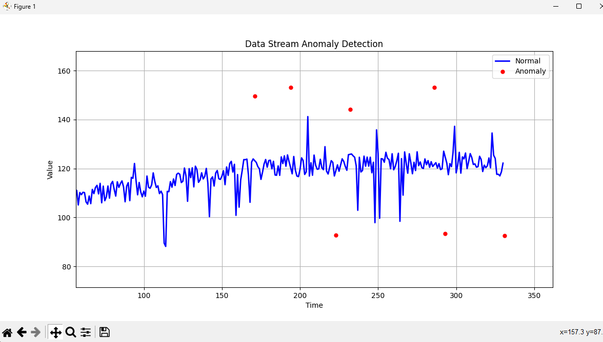

# StreamGlass: Real-Time Anomaly Detection in Data Streams

## Description

StreamGlass is a Python-based tool designed to detect anomalies in continuous data streams. It uses an Adaptive Rolling Average algorithm to identify unusual patterns, such as exceptionally high values or deviations from the norm, in real-time sequences of floating-point numbers.

## Objective

1. Algorithm Selection: Implement an Adaptive Rolling Average algorithm for anomaly detection, capable of adapting to concept drift and seasonal variations.
2. Data Stream Simulation: Design a function to emulate a data stream, incorporating regular patterns, seasonal elements, and random noise.
3. Anomaly Detection: Develop a real-time mechanism to accurately flag anomalies as the data is streamed.
4. Optimization: Ensure the algorithm is optimized for both speed and efficiency.
5. Visualization: Create a straightforward real-time visualization tool to display both the data stream and any detected anomalies.

## Features

- Real-time anomaly detection in continuous data streams
- Data stream simulation with regular patterns, seasonal elements, and random noise
- Visualization of data stream and detected anomalies
- Optimized for both speed and efficiency
- Adaptable to concept drift and seasonal variations

## Installation

1. Clone the repository:
   ```
   git clone https://github.com/yourusername/streamglass.git
   cd streamglass
   ```

2. Install the required packages:
   ```
   pip install -r requirements.txt
   ```

## Usage

Run the main script with optional arguments:

```
python main.py [--window WINDOW] [--threshold THRESHOLD] [--adaptation-rate ADAPTATION_RATE] [--debug]
```

Arguments:
- `--window`: Window size for the detector (default: 100)
- `--threshold`: Initial threshold for anomaly detection (default: 3.5)
- `--adaptation-rate`: Adaptation rate for adaptive rolling average detector (default: 0.1)
- `--debug`: Enable debug mode and log detailed information to a file

Example:
```
python main.py --window 150 --threshold 4.0 --adaptation-rate 0.05
```

## Visualization

The tool provides a real-time visualization of the data stream and detected anomalies:



- Blue line: Normal data points
- Red dots: Detected anomalies
- Gray dashed lines: Current detection window

## Requirements

- Python 3.x
- matplotlib
- numpy
- asyncio

## Configuration

You can adjust the behavior of the anomaly detector and data stream simulator by modifying the parameters in `main.py` and `data_stream.py` respectively.

## Contributing

Contributions to StreamGlass are welcome! Please feel free to submit a Pull Request.

## License

This project is open-source and available under the MIT License.

## Credits

This project was created by Hussein Aljorani. If you use this code or any part of it in your own projects, please include the following credit:

```
Original concept and implementation by Hussein Aljorani
GitHub: https://github.com/huss2342
```